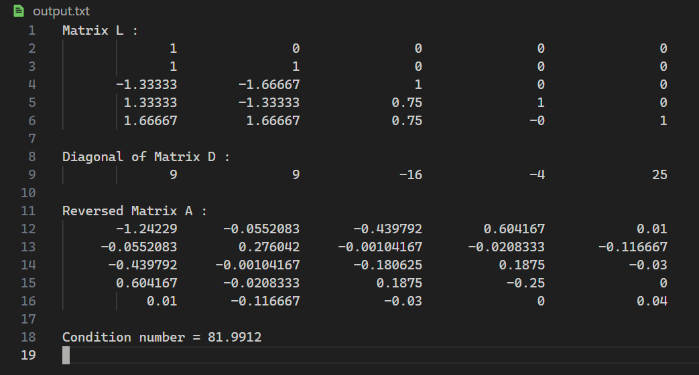
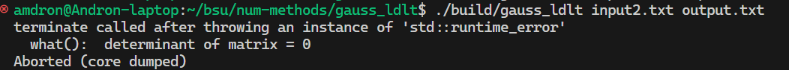
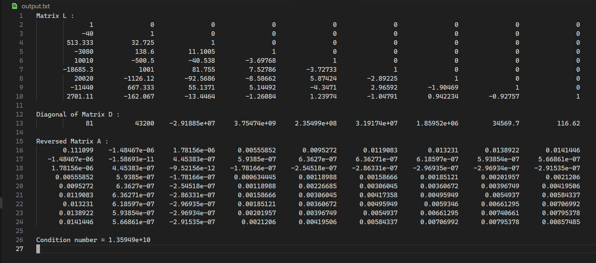
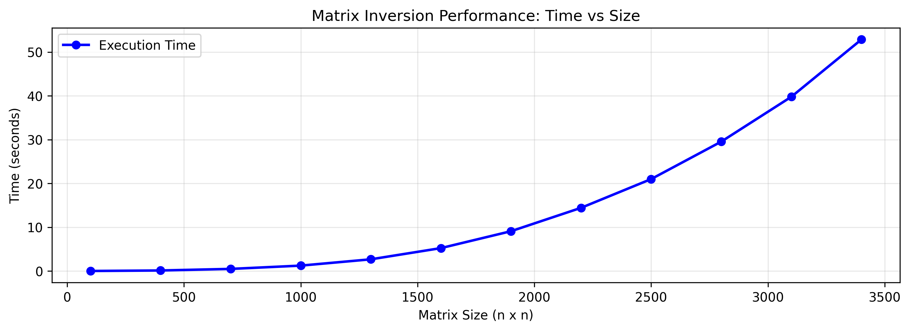

## Задание

1) Написать программу, которая обращает симметричную матрицу методом $LDL^T$-разложения. Кроме матрицы $A^{-1}$ программа должна выводить матрицу $L$ и  главную диагональ матрицы $D$. Применить программу к следующим ниже входным данным и вывести результат
2) Число обусловленности матрицы из второго задания в матричной максимум-норме равно $1.0996545413425 \cdot 10^{12}$  Попробуйте вычислить это число по определению с помощью вашей программы. Сколько точных цифр вам удалось получить? Почему?
3) Проведите экспериментальное исследование скорости работы вашей программы в зависимости от размерности матрицы, используя для тестов матрицу со случайными числами. Постройте график зависимости времени работы от размерности. Матрицу какой размерности ваша программа на вашем компьютере может обратить за одну минуту?

Матрица 1:

$$
\begin{bmatrix}
    9 & 9 & -12 & 12 & 15\\
    9 & 18 & -27 & 0 & 30 \\
    -12 & -27 & 25 & -8 & -57 \\
    12 & 0 & -8 & 19 & -9 \\
    15 & 30 & -57 & -9 & 66 \\
\end{bmatrix}
$$

Матрица 2:

$$
\begin{bmatrix}
    25 & 0 & -5 & 5 & 25 & -10 & -10 & -20 & 5 \\
    0 & 9 & -6 & 3 & -6 & 9 & 3 & 9 & 6 \\
    -5 & -6 & 21 & -15 & 19 & -20 & -8 & 18 & -9 \\
    5 & 3 & -15 & 12 & -8 & 12 & 1 & -20 & 7 \\
    25 & -6 & 19 & -8 & 34 & -58 & -38 & -11 & -12 \\
    -10 & 9 & -20 & 12 & -58 & -15 & 43 & 10 & -5 \\
    -10 & 3 & -8 & 1 & -38 & 43 & -7 & 13 & -10 \\
    -20 & 9 & 18 & -20 & -11 & 10 & 13 & 100 & 8 \\
    5 & 6 & -9 & 7 & -12 & -5 & -10 & 8 & -3 \\
\end{bmatrix}
$$

Матрица 3:

$$
\begin{bmatrix}
    81 & -3240 & 41580 & -249480 & 810810 & -1513512 & 1621620 & -926640 & 218790 \\
    -3240 & 172800 & -249480 & 15966720 & -54054000 & 103783680 & -113513400 &  65894400 & -15752880 \\
    41580 & -249480 & 38419920 & -256132800 & 891891000 & -1748106360 & 1942340400 &    -1141620480 & 275675400 \\
    -249480 & 15966720 & -256132800 & 1756339200 & -6243237000 & 12430978560 &  -13984850880 & 8302694400 & -2021619600 \\
    810810 & -54054000 & 891891000 & -6243237000 & 22545022500 & -45450765360 &     51648597000 & -30918888000 & -7581073500 \\
    -1513512 & 103783680 & -1748106360 & 12430978560 & -45450765360 & 92554285824 &     -106051785840 & 63930746880 & -15768632880 \\
    1621620 & -113513400 & 1942340400 & -13984850880 & 51648597000 & -106051785840 &    122367445200 & -74205331200 & 18396738360 \\
    -926640 & 65894400 & -1141620480 & 8302694400 & -30918888000 & 63930746880 &    -74205331200 & 45229916160 & -11263309200 \\
    218790 & -15752880 & 275675400 & -2021619600 & 7581073500 & -15768632880 &  18396738360 & -11263309200 & 2815827300 \\
\end{bmatrix}
$$


## Ответы

1) Выводы программы для каждой матрицы из условия   
Для матрицы первой:



Для второй матрицы:



Третья матрица:




2) Во втором задании дана вырожденная матрица - для нее не существует числа обусловленности

3) За минуту получилось обратить матрицу размерности 3400




## Running program
```
mkdir build
cmake --build build
./build/gauss_ldlt <input.txt> <output.txt>
```
Where input.txt and output.txt are optional filenames for data
By default program takes input.txt is stdin and stdout

`create_matrix.py` - Python script for generating random input and bencmarking program  
`collect_stats.py` - Python script that runs some benches and saves plot of performance in
`./pictures/benches.png`