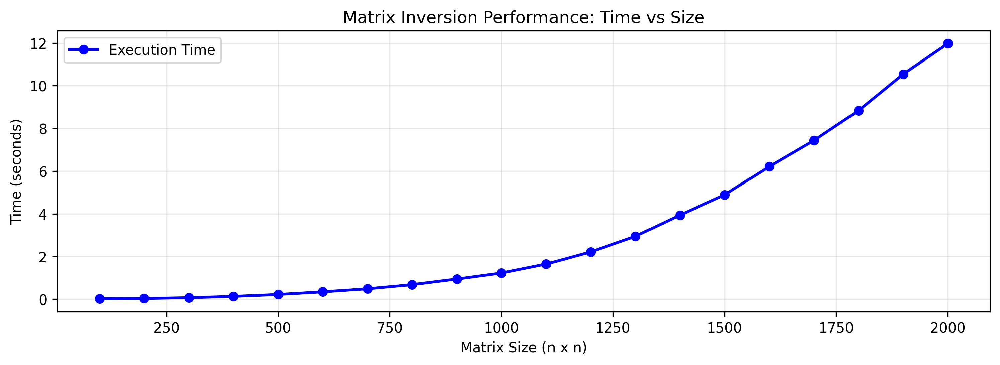

## Задание

1) Написать программу, которая обращает симметричную матрицу методом $LDL^T$-разложения. Кроме матрицы $A^{-1}$ программа должна выводить матрицу $L$ и  главную диагональ матрицы $D$. Применить программу к следующим ниже входным данным и вывести результат
2) Число обусловленности матрицы из третьего задания в матричной максимум-норме равно $1.0996545413425 \cdot 10^{12}$  Попробуйте вычислить это число по определению с помощью вашей программы. Сколько точных цифр вам удалось получить? Почему?
3) Проведите экспериментальное исследование скорости работы вашей программы в зависимости от размерности матрицы, используя для тестов матрицу со случайными числами. Постройте график зависимости времени работы от размерности. Матрицу какой размерности ваша программа на вашем компьютере может обратить за одну минуту?

Матрица 1:

$$
\begin{bmatrix}
    9 & 9 & -12 & 12 & 15\\
    9 & 18 & -27 & 0 & 30 \\
    -12 & -27 & 25 & -8 & -57 \\
    12 & 0 & -8 & 19 & -9 \\
    15 & 30 & -57 & -9 & 66 \\
\end{bmatrix}
$$

Матрица 2:

$$
\begin{bmatrix}
    25 & 0 & -5 & 5 & 25 & -10 & -10 & -20 & 5 \\
    0 & 9 & -6 & 3 & -6 & 9 & 3 & 9 & 6 \\
    -5 & -6 & 21 & -15 & 19 & -20 & -8 & 18 & -9 \\
    5 & 3 & -15 & 12 & -8 & 12 & 1 & -20 & 7 \\
    25 & -6 & 19 & -8 & 34 & -58 & -38 & -11 & -12 \\
    -10 & 9 & -20 & 12 & -58 & -15 & 43 & 10 & -5 \\
    -10 & 3 & -8 & 1 & -38 & 43 & -7 & 13 & -10 \\
    -20 & 9 & 18 & -20 & -11 & 10 & 13 & 100 & 8 \\
    5 & 6 & -9 & 7 & -12 & -5 & -10 & 8 & -3 \\
\end{bmatrix}
$$

Матрица 3:

$$
\begin{bmatrix}
    81 & -3240 & 41580 & -249480 & 810810 & -1513512 & 1621620 & -926640 & 218790 \\
    -3240 & 172800 & -249480 & 15966720 & -54054000 & 103783680 & -113513400 &  65894400 & -15752880 \\
    41580 & -249480 & 38419920 & -256132800 & 891891000 & -1748106360 & 1942340400 &    -1141620480 & 275675400 \\
    -249480 & 15966720 & -256132800 & 1756339200 & -6243237000 & 12430978560 &  -13984850880 & 8302694400 & -2021619600 \\
    810810 & -54054000 & 891891000 & -6243237000 & 22545022500 & -45450765360 &     51648597000 & -30918888000 & -7581073500 \\
    -1513512 & 103783680 & -1748106360 & 12430978560 & -45450765360 & 92554285824 &     -106051785840 & 63930746880 & -15768632880 \\
    1621620 & -113513400 & 1942340400 & -13984850880 & 51648597000 & -106051785840 &    122367445200 & -74205331200 & 18396738360 \\
    -926640 & 65894400 & -1141620480 & 8302694400 & -30918888000 & 63930746880 &    -74205331200 & 45229916160 & -11263309200 \\
    218790 & -15752880 & 275675400 & -2021619600 & 7581073500 & -15768632880 &  18396738360 & -11263309200 & 2815827300 \\
\end{bmatrix}
$$


## Ответы

1) Выводы программы для каждой матрицы из условия   
Для матрицы первой:


Для второй матрицы:


Третья матрица:


код:
https://github.com/Amdronm/num-methods/tree/main/gauss_ldlt


2) В третьем задании число обусловленности по матричной максимум норме (максимальная сумма модулей элементов строки)
   получилась равной $69721112136.237548828 \quad = (6.9721112136 \cdot 10^{10})$, что сильно отличается от данного даже порядком. Точных цифр получается только 15, т. к. тип `double` в С++ имеет именно такую точность.
    

3) За минуту получилось обратить матрицу размерности 3400




## Running program
```
mkdir build
cd build
cmake ..
./build/gauss_ldlt <input.txt> <output.txt>
```
Where input.txt and output.txt are optional filenames for data
By default program takes input.txt is stdin and stdout

`create_matrix.py` - Python script for generating random input and bencmarking program  
`collect_stats.py` - Python script that runs some benches and saves plot of performance in
`./pictures/benches.png`

`matrix.h`

```c++
#pragma once

#include <cstddef>
#include <cstdlib>
#include <iomanip>
#include <ostream>
#include <stdexcept>
#include <utility>
#include <vector>

constexpr double kEps = 1e-14;
constexpr size_t kWidth = 15;

class Matrix;

Matrix Identity(size_t dim);
Matrix Transpose(const Matrix& mat);

class Matrix {
public:
    Matrix(size_t rows, size_t cols) {
        data_ = std::vector<std::vector<double>>(rows,
                                                 std::vector<double>(cols, 0));
    }

    Matrix(size_t dim) {
        data_ =
            std::vector<std::vector<double>>(dim, std::vector<double>(dim, 0));
    }

    Matrix(const std::vector<std::vector<double>>& data) : data_(data) {}

    Matrix(const std::vector<double>& diag) {
        Matrix mat = Matrix(diag.size());
        for (size_t i = 0; i < diag.size(); ++i) {
            mat[i, i] = diag[i];
        }
        *this = mat;
    }

    size_t Rows() const { return data_.size(); }

    size_t Columns() const { return data_.front().size(); }

    bool operator==(const Matrix& other) const = default;

    double& operator[](size_t row, size_t col) { return data_[row][col]; }

    double operator[](size_t row, size_t col) const { return data_[row][col]; }

    std::vector<double>& operator[](size_t row) { return data_[row]; }

    Matrix operator*(const Matrix& other) const {
        Matrix res = Matrix(this->Rows(), other.Columns());
        for (size_t i = 0; i < res.Rows(); ++i) {
            for (size_t j = 0; j < res.Columns(); ++j) {
                double elem = 0.;
                for (size_t k = 0; k < this->Columns(); ++k) {
                    elem += (*this)[i, k] * other[k, j];
                }
                res[i, j] = elem;
            }
        }
        return res;
    }

    Matrix& operator*=(const Matrix& other) {
        Matrix mul = (*this) * other;
        *this = mul;
        return *this;
    }

    std::vector<double> GetDiagonal() const {
        std::vector<double> res(data_.size());
        for (size_t i = 0; i < data_.size(); ++i) {
            res[i] = data_[i][i];
        }
        return res;
    }

    friend std::ostream& operator<<(std::ostream& out, const Matrix& mat) {
        for (const auto& row : mat.data_) {
            for (const auto& elem : row) {
                out << std::setw(kWidth) << elem << " ";
            }
            out << "\n";
        }
        return out;
    }

    void MultiplyAddRow(size_t bear_row, double val, size_t row) {
        for (size_t j = 0; j < this->Columns(); ++j) {
            data_[row][j] += data_[bear_row][j] * val;
        }
    }

    // throws if det(M) == 0
    double FindMaxElemInColumn(size_t row, size_t col) {
        size_t idx = row;
        for (size_t i = row; i < this->Rows(); ++i) {
            if (data_[i][col] > data_[idx][col]) {
                idx = i;
            }
        }
        std::swap(data_[idx], data_[row]);
        if (std::abs(data_[row][col]) < kEps) {
            throw std::runtime_error("determinant of matrix = 0");
        }
        return data_[row][col];
    }

    // returns L matrix, making U from given matrix
    Matrix FindLUDecomp() {
        Matrix res = Identity(this->Rows());
        for (size_t j = 0; j < this->Columns(); ++j) {
            double op_elem = data_[j][j];
            if (std::abs(op_elem) < kEps) {
                op_elem = this->FindMaxElemInColumn(j, j);
            }
            for (size_t i = j + 1; i < this->Rows(); ++i) {
                double rev = -data_[i][j] / op_elem;
                this->MultiplyAddRow(j, rev, i);
                res[i, j] = -rev;
            }
        }
        return res;
    }

private:
    std::vector<std::vector<double>> data_;
};

Matrix Transpose(const Matrix& mat) {
    Matrix res = Matrix(mat.Columns(), mat.Rows());
    for (size_t i = 0; i < mat.Rows(); ++i) {
        for (size_t j = 0; j < mat.Columns(); ++j) {
            res[j, i] = mat[i, j];
        }
    }
    return res;
}

Matrix Identity(size_t dim) {
    Matrix res = Matrix(dim);
    for (size_t i = 0; i < res.Rows(); ++i) {
        res[i, i] = 1;
    }
    return res;
}

```

`main.cpp`

```c++
#include <cmath>
#include <cstddef>
#include <cstring>
#include <fstream>
#include <iomanip>
#include <ios>
#include <iostream>
#include <istream>
#include <ostream>
#include <vector>

#include "matrix.h"

Matrix ReadMatrix(std::istream& fin) {
    if (fin.bad()) {
        std::cerr << "Wrong file" << std::endl;
        return 0;
    }
    size_t n = 0;
    fin >> n;

    Matrix mat_a = Matrix(n);

    for (size_t i = 0; i < n; ++i) {
        for (size_t j = 0; j < n; ++j) {
            fin >> mat_a[i, j];
        }
    }
    return mat_a;
}

// solves mat*x=vec system with bot triangle mat
std::vector<double> SolveBotTriangle(const Matrix& mat,
                                     const std::vector<double>& vec) {
    std::vector<double> sol;
    sol.reserve(vec.size());
    sol.push_back(vec.front());
    for (size_t i = 1; i < vec.size(); ++i) {
        double x = vec[i];
        for (size_t j = 0; j < i; ++j) {
            x -= mat[i, j] * sol[j];
        }
        sol.push_back(x);
    }
    return sol;
}

// solves mat*x=vec system with top triangle mat
std::vector<double> SolveTopTriangle(const Matrix& mat,
                                     const std::vector<double>& vec) {
    std::vector<double> sol(vec.size());
    sol.back() = vec.back();
    for (int i = vec.size() - 2; i >= 0; --i) {
        double x = vec[i];
        for (size_t j = i; j < vec.size(); ++j) {
            x -= mat[i, j] * sol[j];
        }
        sol[i] = x;
    }
    return sol;
}

void MulVector(std::vector<double>& vec, const std::vector<double>& vec_by) {
    for (size_t i = 0; i < vec.size(); ++i) {
        vec[i] *= vec_by[i];
    }
}

template <class T>
std::ostream& operator<<(std::ostream& out, const std::vector<T>& other) {
    for (const auto& elem : other) {
        out << std::setw(kWidth) << elem << " ";
    }
    out << "\n";
    return out;
}

// returns matrix maximum norm
double FindMaxNorm(const Matrix& mat) {
    double y = 0.;
    for (size_t i = 0; i < mat.Rows(); ++i) {
        double norm = 0.;
        for (size_t j = 0; j < mat.Columns(); ++j) {
            norm += std::fabs(mat[i, j]);
        }
        y = std::max(norm, y);
    }
    return y;
}

void SolveFast(std::istream& in, std::ostream& out);

int main(int argc, char* argv[]) {
    std::ios_base::sync_with_stdio(false);

    std::ifstream fin;
    std::ofstream fout;
    std::istream* in_ptr;
    std::ostream* out_ptr;

    if (argc != 3) {
        fin.open("input.txt");
        in_ptr = &fin;
        out_ptr = &std::cout;
    } else {
        fin.open(argv[1]);
        in_ptr = &fin;

        fout.open(argv[2]);
        out_ptr = &fout;

        if (!fin.is_open() || !fout.is_open()) {
            std::cerr << "wrong filename(s)" << std::endl;
            return 1;
        }
    }
    auto& in = *in_ptr;
    auto& out = *out_ptr;

    SolveFast(in, out);

    return 0;
}

void SolveFast(std::istream& in, std::ostream& out) {
    Matrix mat_a = ReadMatrix(in);
    double norm_a = FindMaxNorm(mat_a);

    Matrix mat_l = mat_a.FindLUDecomp();
    auto diag_d = mat_a.GetDiagonal();

    out << "Matrix L :\n" << mat_l << "\nDiagonal of Matrix D : \n" << diag_d;
    auto diag_d_rev = diag_d;
    for (auto& elem : diag_d_rev) {
        elem = 1. / elem;
    }

    /// here we find A^-1 solving
    /// n eqations Ax=e_i i = 1,2,...,n
    /// where e_i = (0, 0, ..., 1, ... 0) 1 in i position
    /// first Ly_i=e_i
    /// y *= D^-1
    /// L^t*x_i=y_i
    /// x_i is i column of A^-1
    /// thus we solved A*A^-1=E column by column
    size_t dim = diag_d.size();
    Matrix rev_a(dim);
    auto mat_lt = Transpose(mat_l);
    for (size_t i = 0; i < dim; ++i) {
        std::vector<double> vec_e(dim, 0.);
        vec_e[i] = 1.;
        auto y = SolveBotTriangle(mat_l, vec_e);
        MulVector(y, diag_d_rev);
        y = SolveTopTriangle(mat_lt, y);
        rev_a[i] = y;
    }

    out << "\nReversed Matrix A : \n" << rev_a;

    out << "\nCondition number = "
        // << std::setprecision(15)
        << norm_a * FindMaxNorm(rev_a) << std::endl;
}
```